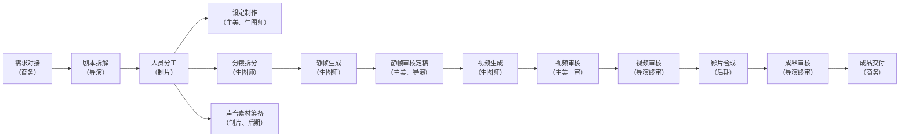

+++
title = "AI 漫剧"
slug = "ai-man-ju"
date = "2026-09-05T14:21:01+08:00"
draft = false
categories = ["漫剧"]
tags = ["ai"]
image = "/posts/ai-man-ju/images/cover.webp"
description = "ai漫剧注意点"
featured = true
toc = true
+++
## AI漫剧制作SOP

阶段说明

| 阶段 | 核心输入 | 核心产出 |
| --- | --- | --- |
| 1. 剧本 | 小说 / IP | 结构化分镜脚本：包含场景、景别、人物动作 / 表情、关键台词 |
| 2. 分镜 | 分镜脚本 | 视觉化分镜稿：精准的提示词，指导画面生成 |
| 3. 生图 | 分镜提示词 | 风格统一的静帧图片：解决角色一致性是关键 |
| 4. 视频 | 静帧图片 | 动态视频片段：为静态图添加运镜、动态 |
| 5. 合成 | 视频片段、音频素材 | 成品漫剧：完成剪辑、配音、音效、字幕、调色 |