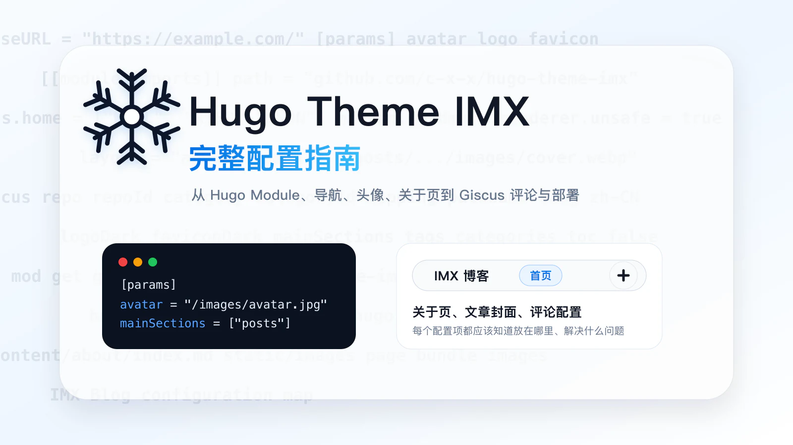
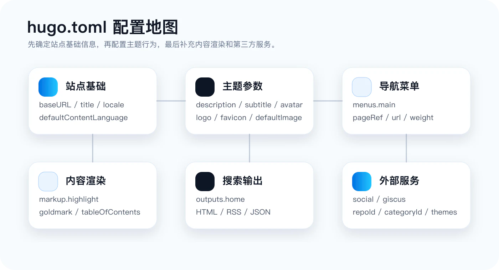
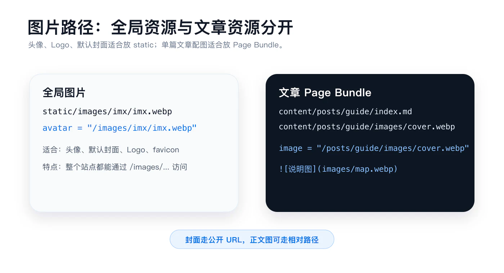
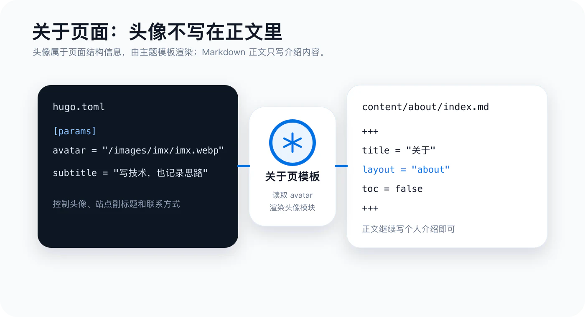
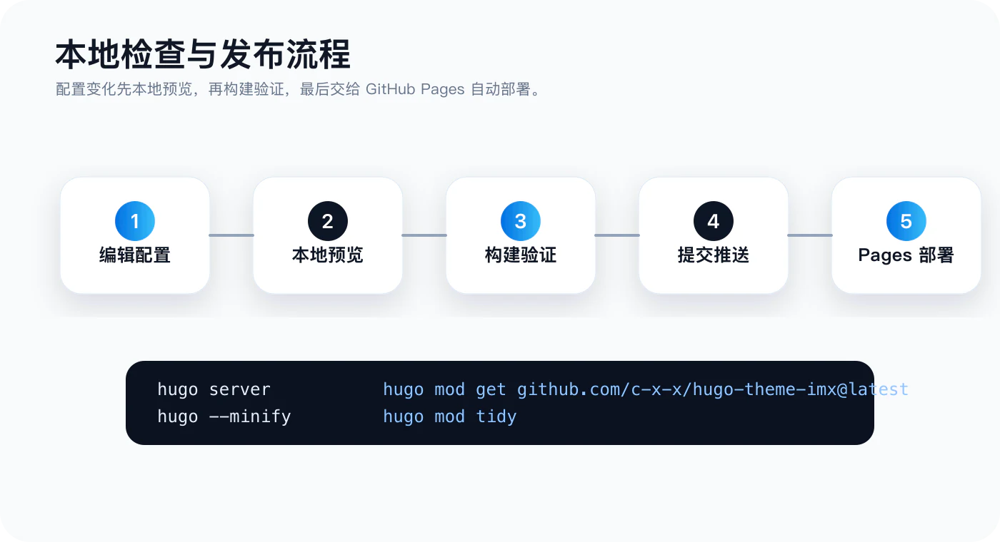

+++
title = 'Hugo Theme IMX 主题配置指南'
date = '2026-07-07T10:00:00+08:00'
draft = false
categories = ['技术', '教程']
tags = ['Hugo', 'IMX Theme', '主题配置', 'Hugo Module', '博客']
image = '/posts/hugo-theme-imx-configuration-guide/images/cover.webp'
description = '一篇面向实际使用的 Hugo Theme IMX 配置指南，覆盖 Hugo Module、站点参数、导航、头像、关于页面、文章封面、Giscus 评论、Markdown 渲染、搜索和部署更新流程。'
toc = true
+++



IMX 是一个通过 Hugo Module 使用的中文博客主题。它不需要放进 `themes/` 目录，也不需要在配置里写 `theme = "..."`，站点通过 Go Module 引入主题，然后由 Hugo 在构建时合并主题模板、资源和默认配置。

这篇文章不讲“从零认识 Hugo”，只讲一件事：**如何把 IMX 主题配置清楚**。如果你已经有一个 Hugo 站点，照着本文检查一遍，基本可以把首页、文章列表、关于页、评论、搜索、图片和部署流程都理顺。



## 一、配置文件放在哪里

站点的主配置文件一般是根目录下的 `hugo.toml`：

```text
your-site/
├── content/
├── static/
├── go.mod
├── go.sum
└── hugo.toml
```

IMX 主题推荐把主要配置都写在 `hugo.toml` 里。除非站点规模很大，否则没有必要一开始就拆成多个配置文件。

一个可以工作的最小配置如下：

```toml
baseURL = 'https://example.com/'
defaultContentLanguage = 'zh-cn'
locale = 'zh-CN'
title = '我的博客'

[params]
  description = '站点描述'
  subtitle = '首页副标题'
  author = '你的名字'
  mainSections = ['posts']

[outputs]
  home = ['HTML', 'RSS', 'JSON']

[module]
  [[module.imports]]
    path = 'github.com/c-x-x/hugo-theme-imx'
```

这几项先不要省：

- `baseURL`：站点最终访问地址，影响 canonical、RSS、Open Graph 图片地址。
- `title`：站点标题，会出现在导航、首页、关于页和网页标题里。
- `[params]`：主题参数区，IMX 的头像、Logo、默认图片、评论、社交链接都在这里配置。
- `[outputs].home`：必须保留 `JSON`，站内搜索依赖首页生成的 `index.json`。
- `[module.imports]`：主题通过 Hugo Module 引入，不能用传统 `theme = "xxx"`。

## 二、安装与更新主题

如果站点还没有 `go.mod`，先执行：

```bash
hugo mod init github.com/your-name/your-site
```

然后在 `hugo.toml` 里导入主题：

```toml
[module]
  [[module.imports]]
    path = 'github.com/c-x-x/hugo-theme-imx'
```

首次拉取主题：

```bash
hugo mod get github.com/c-x-x/hugo-theme-imx@latest
hugo mod tidy
```

如果你希望固定在某个版本，可以把 `@latest` 换成具体版本号：

```bash
hugo mod get github.com/c-x-x/hugo-theme-imx@v1.1.3
hugo mod tidy
```

更新主题时再执行一次：

```bash
hugo mod get -u github.com/c-x-x/hugo-theme-imx
hugo mod tidy
```

`go.mod` 和 `go.sum` 都应该提交到仓库。它们记录了站点使用的主题版本，GitHub Pages 或其他 CI 环境才能稳定复现构建结果。

## 三、站点基础配置

基础配置建议保持简洁：

```toml
baseURL = 'https://blog.example.com/'
defaultContentLanguage = 'zh-cn'
locale = 'zh-CN'
title = 'IMX-博客'
```

### baseURL

`baseURL` 写站点最终的线上地址。常见写法：

```toml
baseURL = 'https://blog.example.com/'
```

如果是 GitHub Pages 用户站点：

```toml
baseURL = 'https://your-name.github.io/'
```

如果是项目站点：

```toml
baseURL = 'https://your-name.github.io/project-name/'
```

`baseURL` 不只是首页链接，它还会影响：

- RSS 地址
- canonical 地址
- Open Graph 图片地址
- Twitter Card 图片地址
- 部分绝对路径资源

上线前一定要确认它和最终域名一致。

### defaultContentLanguage 与 locale

中文站点推荐：

```toml
defaultContentLanguage = 'zh-cn'
locale = 'zh-CN'
```

`defaultContentLanguage` 主要给 Hugo 使用，`locale` 主要帮助模板和浏览器理解站点区域。IMX 面向中文博客，这两个值保持上面这样即可。

### title

`title` 是站点级名称：

```toml
title = 'IMX-博客'
```

它会显示在：

- 顶部导航品牌区
- 首页主标题
- 关于页标题区域
- 浏览器标题
- Open Graph `og:site_name`

如果你希望导航短一点，站点标题最好也不要太长。中文 4 到 8 个字会比较舒服。

## 四、主题参数 params

IMX 的主要主题配置都在 `[params]` 下：

```toml
[params]
  description = '真相一旦入眼，你无法视而不见！'
  subtitle = '真相一旦入眼，你无法视而不见。'
  author = 'CB'
  avatar = '/images/imx/imx.webp'
  mainSections = ['posts']
  keywords = ['技术博客', 'JavaScript', 'Python', 'Go', 'Java', 'C++', '编程']
```

### description

```toml
description = '真相一旦入眼，你无法视而不见！'
```

`description` 是站点描述。它主要用于：

- HTML `<meta name="description">`
- Open Graph 描述
- Twitter Card 描述
- 没有单独 `description` 的页面兜底

建议写成一句完整的话，不要堆关键词。

### subtitle

```toml
subtitle = '真相一旦入眼，你无法视而不见。'
```

`subtitle` 是首页副标题，也会出现在关于页的主题头像模块里。它更像站点口号，可以比 `description` 更有个性。

### author

```toml
author = 'CB'
```

`author` 会进入页面元信息。它不等于导航显示名称，导航显示的是 `title`。

### keywords

```toml
keywords = ['技术博客', 'JavaScript', 'Python', 'Go', 'Java', 'C++', '编程']
```

关键词用于 `<meta name="keywords">`。现代搜索引擎已经不太依赖它，但保留一组准确关键词没有坏处。建议控制在 5 到 10 个，不要写成一长串。

### mainSections

```toml
mainSections = ['posts']
```

IMX 首页会从 `mainSections` 指定的内容类型里取文章。默认文章目录通常是：

```text
content/posts/
```

如果你只写技术文章，保持 `['posts']` 就好。如果你未来有多个内容区，比如 `notes`、`essays`，可以写：

```toml
mainSections = ['posts', 'notes', 'essays']
```

## 五、Logo、头像、favicon 和默认图片

图片配置建议统一放在 `[params]` 下：

```toml
[params]
  logo = '/images/imx/logo.svg'
  logoDark = '/images/imx/logo-dark.svg'
  avatar = '/images/imx/imx.webp'
  favicon = '/images/imx/favicon.svg'
  faviconDark = '/images/imx/favicon-dark.svg'
  defaultImage = '/images/imx/default-cover.jpg'
  defaultOGImage = '/images/imx/default-og.jpg'
```

### logo

`logo` 用在顶部导航品牌区：

```toml
logo = '/images/imx/logo.svg'
```

如果你不配置，主题会使用内置雪花 Logo。

### logoDark

`logoDark` 是深色模式 Logo：

```toml
logoDark = '/images/imx/logo-dark.svg'
```

如果你配置了自定义 `logo`，但没有配置 `logoDark`，深浅色模式会复用同一张图。对纯黑 Logo 来说，深色模式里可能看不清，所以建议提供一份纯白或亮色版本。

### avatar

`avatar` 是头像：

```toml
avatar = '/images/imx/imx.webp'
```

它会用于：

- 首页头像
- 关于页头像模块
- apple touch icon 的默认兜底

注意：**头像不要写在关于页 Markdown 正文里**。如果在 Markdown 正文里插入图片，它会被当作普通正文图片，尺寸会接近文章宽度，看起来就会很大。

头像应该放在 `params.avatar`：

```toml
[params]
  avatar = '/images/imx/imx.webp'
```

然后关于页使用主题模板渲染头像。

### favicon 与 faviconDark

```toml
favicon = '/images/imx/favicon.svg'
faviconDark = '/images/imx/favicon-dark.svg'
```

`favicon` 是浏览器标签页图标。`faviconDark` 用于深色模式。IMX 会在主题模式切换时更新 favicon。

### defaultImage

```toml
defaultImage = '/images/imx/default-cover.jpg'
```

当文章没有配置 `image` 时，首页卡片和文章列表卡片会使用 `defaultImage`。

### defaultOGImage

```toml
defaultOGImage = '/images/imx/default-og.jpg'
```

当页面没有自己的分享图时，Open Graph 和 Twitter Card 会使用 `defaultOGImage`。

## 六、图片应该放在哪里

IMX 主题里图片有两类常见放法。



### 全局图片放 static

适合放在 `static/` 的图片：

- 头像
- Logo
- favicon
- 默认封面
- 默认分享图
- 多篇文章都会复用的图片

目录示例：

```text
static/
└── images/
    └── imx/
        ├── imx.webp
        ├── logo.svg
        ├── logo-dark.svg
        ├── favicon.svg
        └── favicon-dark.svg
```

配置时从站点根路径写起：

```toml
avatar = '/images/imx/imx.webp'
logo = '/images/imx/logo.svg'
favicon = '/images/imx/favicon.svg'
```

### 单篇文章图片放 Page Bundle

一篇文章自己的图片，推荐和文章放在一起：

```text
content/posts/hugo-theme-imx-configuration-guide/
├── index.md
└── images/
    ├── cover.webp
    ├── config-map.webp
    └── about-page.webp
```

正文中可以用相对路径：

```md

```

但是文章封面 `image` 要注意：IMX 当前会把 `image` 当作公开 URL 处理。Page Bundle 文章的封面建议写成发布后的公开路径：

```toml
image = '/posts/hugo-theme-imx-configuration-guide/images/cover.webp'
```

如果你把封面放在 `static/images/posts/cover.jpg`，则写：

```toml
image = '/images/posts/cover.jpg'
```

简单判断：

- 多篇文章共用：放 `static/images/...`
- 只属于这篇文章：放 `content/posts/文章文件夹/images/...`
- 正文图片：可以相对写 `images/xxx`
- Front Matter 的 `image`：写公开路径 `/posts/.../images/xxx` 或 `/images/...`

## 七、导航菜单

IMX 默认提供五个导航项：

- 首页
- 文章
- 分类
- 标签
- 关于

如果你想控制顺序、名称或链接，配置 `menus.main`：

```toml
[[menus.main]]
  name = '首页'
  pageRef = '/'
  weight = 10

[[menus.main]]
  name = '文章'
  pageRef = '/posts'
  weight = 20

[[menus.main]]
  name = '分类'
  url = '/categories/'
  weight = 30

[[menus.main]]
  name = '标签'
  url = '/tags/'
  weight = 40

[[menus.main]]
  name = '关于'
  pageRef = '/about'
  weight = 50
```

### pageRef 和 url 怎么选

优先用 `pageRef`：

```toml
pageRef = '/posts'
```

`pageRef` 指向 Hugo 内容页面，Hugo 会帮你处理语言、路径和页面关系。

外部链接或纯路径可以用 `url`：

```toml
url = 'https://github.com/c-x-x'
```

分类和标签页也可以用 `url`：

```toml
url = '/categories/'
url = '/tags/'
```

### weight

`weight` 控制排序，数字越小越靠前。建议间隔 10 写，后续插入菜单项比较方便：

```toml
weight = 10
weight = 20
weight = 30
```

## 八、关于页面配置

关于页是最容易踩坑的地方。IMX 的关于页模板不是普通文章模板，它会额外渲染头像、站点名称、副标题和联系方式。



推荐目录结构：

```text
content/
└── about/
    └── index.md
```

`content/about/index.md` 示例：

```toml
+++
title = '关于'
date = 2026-06-13
draft = false
toc = false
layout = 'about'
+++
```

正文继续写个人介绍：

```md
## 欢迎

这里是我记录技术学习和生活思考的地方。

### 技术栈

- **前端:** JavaScript, TypeScript, Vue, React
- **后端:** Python, Go, Java
- **其他:** CodeX, Claude Code
```

关键是这一行：

```toml
layout = 'about'
```

没有它时，Hugo 可能会把 `/about/` 当成普通页面，走普通文章模板。这样主题提供的关于页头像模块就不会出现。

头像不要写成：

```md

```

这会被当成正文图片，尺寸会很大。正确做法是写在 `hugo.toml`：

```toml
[params]
  avatar = '/images/imx/imx.webp'
```

关于页模板会自动读取它。

### 关于页联系方式

联系方式来自 `[params.social]`：

```toml
[params.social]
  github = 'https://github.com/c-x-x'
  email = 'hello@example.com'
```

如果这两个字段都不配置，关于页的联系方式区块就不会显示。

## 九、社交链接

目前常用配置：

```toml
[params.social]
  github = 'https://github.com/your-name'
  email = 'hello@example.com'
```

`github` 会渲染 GitHub 图标链接。`email` 会渲染邮件链接：

```text
mailto:hello@example.com
```

如果你不想公开邮箱，可以不写 `email`，只保留 GitHub。

## 十、Giscus 评论配置

IMX 支持 Giscus 评论。先到 [giscus.app](https://giscus.app/zh-CN) 生成配置，然后填进 `hugo.toml`：

```toml
[params.giscus]
  enabled = true
  repo = 'your-name/comments'
  repoId = 'R_...'
  category = 'Announcements'
  categoryId = 'DIC_...'
  mapping = 'pathname'
  lang = 'zh-CN'
  lightTheme = 'light'
  darkTheme = 'dark'
```

字段说明：

| 字段 | 说明 |
| --- | --- |
| `enabled` | 是否开启评论 |
| `repo` | 用来存放评论的 GitHub 仓库 |
| `repoId` | Giscus 生成的仓库 ID |
| `category` | Discussion 分类名称 |
| `categoryId` | Giscus 生成的分类 ID |
| `mapping` | 评论与页面的匹配方式 |
| `lang` | 评论区语言 |
| `lightTheme` | 浅色模式下的 Giscus 主题 |
| `darkTheme` | 深色模式下的 Giscus 主题 |

推荐：

```toml
mapping = 'pathname'
lang = 'zh-CN'
lightTheme = 'light'
darkTheme = 'dark'
```

`pathname` 的好处是：只要文章 URL 不变，评论就能稳定关联。

如果你暂时不想开评论：

```toml
[params.giscus]
  enabled = false
```

## 十一、Markdown 与代码块配置

IMX 依赖 Hugo 的 Goldmark 渲染 Markdown。推荐配置：

```toml
[markup]
  [markup.highlight]
    anchorLineNos = false
    codeFences = true
    guessSyntax = false
    hl_Lines = ''
    lineAnchors = ''
    lineNoStart = 1
    lineNos = false
    lineNumbersInTable = true
    noClasses = false
    noHl = false
    style = 'dracula'
    tabWidth = 4

  [markup.tableOfContents]
    endLevel = 5
    ordered = false
    startLevel = 2

  [markup.goldmark.renderer]
    unsafe = true

  [markup.goldmark.parser]
    autoHeadingID = true
    autoHeadingIDType = 'github'

  [markup.goldmark.parser.attribute]
    block = true
    title = true
```

### highlight

`noClasses = false` 很重要：

```toml
noClasses = false
```

它会让 Hugo 输出带 class 的代码高亮结构，主题 CSS 才能更好地接管代码块样式。

`guessSyntax = false` 推荐保留。写代码块时明确语言：

````md
```toml
[params]
  subtitle = '首页副标题'
```
````

不要写成：

````md
```
[params]
  subtitle = '首页副标题'
```
````

明确语言后，代码块标题、复制按钮和高亮效果都更稳定。

### tableOfContents

```toml
[markup.tableOfContents]
  startLevel = 2
  endLevel = 5
  ordered = false
```

文章目录会从 `##` 开始，到 `#####` 结束。一般文章不建议把 `######` 也放进目录，层级太深会影响阅读。

### unsafe

```toml
[markup.goldmark.renderer]
  unsafe = true
```

开启后，Markdown 里的 HTML 可以被渲染。比如你需要临时写：

```html
<kbd>Command</kbd>
```

如果你完全不写 HTML，可以关闭它。但很多技术文章会偶尔用到 HTML，保留 `true` 更灵活。

### attribute

```toml
[markup.goldmark.parser.attribute]
  block = true
  title = true
```

这允许你给 Markdown 元素加属性。比如：

```md

```

或者在支持的场景里加 class。是否使用取决于文章写法，开启后更灵活。

## 十二、搜索配置

IMX 的搜索依赖首页 JSON 输出。必须有：

```toml
[outputs]
  home = ['HTML', 'RSS', 'JSON']
```

还需要定义 JSON 输出格式：

```toml
[outputFormats.JSON]
  mediaType = 'application/json'
  baseName = 'index'
  isPlainText = true
```

构建后，站点根目录会生成：

```text
/index.json
```

主题的搜索框会请求这个文件，然后在前端进行标题和摘要搜索。

如果搜索没有结果，先检查：

1. `outputs.home` 有没有 `JSON`
2. `outputFormats.JSON` 有没有配置
3. 构建产物里有没有 `index.json`
4. 浏览器控制台有没有 404

## 十三、文章 Front Matter

本站文章统一使用 Page Bundle：

```text
content/posts/my-post/
├── index.md
└── images/
    └── cover.webp
```

推荐 Page Bundle，尤其是文章有多张配图时。

文章 Front Matter 示例：

```toml
+++
title = '文章标题'
date = '2026-07-07T10:00:00+08:00'
draft = false
categories = ['技术', '教程']
tags = ['Hugo', 'IMX Theme']
image = '/posts/my-post/images/cover.webp'
description = '文章摘要，会用于列表卡片和搜索结果。'
toc = true
+++
```

字段说明：

| 字段 | 作用 |
| --- | --- |
| `title` | 文章标题 |
| `date` | 发布时间 |
| `draft` | 是否草稿 |
| `categories` | 分类，通常 1 到 2 个 |
| `tags` | 标签，可以多个 |
| `image` | 列表卡片封面和分享图 |
| `description` | 摘要、SEO 描述、列表摘要 |
| `toc` | 是否显示目录 |

### draft

```toml
draft = false
```

草稿文章默认不会在正式构建中出现。如果本地想看草稿：

```bash
hugo server -D
```

### categories 和 tags

建议分类少而稳定，标签多而灵活。

例如：

```toml
categories = ['技术', '教程']
tags = ['Hugo', 'IMX Theme', 'GitHub Pages']
```

分类更像书架，标签更像索引。

### image

`image` 是封面图。它影响：

- 首页精选文章卡片
- 文章列表卡片
- Open Graph 图片
- Twitter Card 图片

如果不写，主题使用 `params.defaultImage`。

### description

`description` 会显示在文章卡片摘要里，也会进入页面 meta。建议写成 50 到 120 字的自然语言，不要只堆关键词。

### toc

```toml
toc = true
```

文章比较长时建议开启目录。短文章可以关闭：

```toml
toc = false
```

## 十四、页面类型与 layout

普通文章通常不需要写 `layout`。但关于页需要：

```toml
layout = 'about'
```

因为 `/about/` 需要使用主题提供的关于页模板，而不是普通文章模板。

推荐：

```text
content/about/index.md
```

```toml
+++
title = '关于'
date = 2026-06-13
draft = false
toc = false
layout = 'about'
+++
```

如果你发现关于页头像没有按主题样式显示，而是 Markdown 里的头像变得很大，通常就是因为：

- 在正文里手动插入头像
- 没有使用 `layout = 'about'`
- 或者访问到的不是 `content/about/index.md`

## 十五、完整配置模板

下面是一份比较完整的 `hugo.toml` 示例，可以按需删减：

```toml
baseURL = 'https://blog.example.com/'
defaultContentLanguage = 'zh-cn'
locale = 'zh-CN'
title = 'IMX-博客'

[params]
  description = '这里是站点描述。'
  subtitle = '这里是首页副标题。'
  author = 'CB'
  avatar = '/images/imx/imx.webp'
  logo = '/images/imx/logo.svg'
  logoDark = '/images/imx/logo-dark.svg'
  favicon = '/images/imx/favicon.svg'
  faviconDark = '/images/imx/favicon-dark.svg'
  defaultImage = '/images/imx/default-cover.jpg'
  defaultOGImage = '/images/imx/default-og.jpg'
  mainSections = ['posts']
  keywords = ['技术博客', 'Hugo', 'IMX Theme']

  [params.social]
    github = 'https://github.com/your-name'
    email = 'hello@example.com'

  [params.giscus]
    enabled = true
    repo = 'your-name/comments'
    repoId = 'R_...'
    category = 'Announcements'
    categoryId = 'DIC_...'
    mapping = 'pathname'
    lang = 'zh-CN'
    lightTheme = 'light'
    darkTheme = 'dark'

[markup]
  [markup.highlight]
    anchorLineNos = false
    codeFences = true
    guessSyntax = false
    hl_Lines = ''
    lineAnchors = ''
    lineNoStart = 1
    lineNos = false
    lineNumbersInTable = true
    noClasses = false
    noHl = false
    style = 'dracula'
    tabWidth = 4

  [markup.tableOfContents]
    endLevel = 5
    ordered = false
    startLevel = 2

  [markup.goldmark.renderer]
    unsafe = true

  [markup.goldmark.parser]
    autoHeadingID = true
    autoHeadingIDType = 'github'

  [markup.goldmark.parser.attribute]
    block = true
    title = true

[outputs]
  home = ['HTML', 'RSS', 'JSON']

[outputFormats.JSON]
  mediaType = 'application/json'
  baseName = 'index'
  isPlainText = true

[[menus.main]]
  name = '首页'
  pageRef = '/'
  weight = 10

[[menus.main]]
  name = '文章'
  pageRef = '/posts'
  weight = 20

[[menus.main]]
  name = '分类'
  url = '/categories/'
  weight = 30

[[menus.main]]
  name = '标签'
  url = '/tags/'
  weight = 40

[[menus.main]]
  name = '关于'
  pageRef = '/about'
  weight = 50

[module]
  [[module.imports]]
    path = 'github.com/c-x-x/hugo-theme-imx'
```

## 十六、本地预览与发布检查



本地预览：

```bash
hugo server
```

如果要包含草稿：

```bash
hugo server -D
```

构建检查：

```bash
hugo --minify
```

如果使用 GitHub Pages，建议每次提交前至少跑一次构建。这样可以提前发现：

- 配置文件语法错误
- Front Matter 写错
- Hugo Module 拉取失败
- 图片路径写错
- Markdown 中 HTML 不被允许

更新主题：

```bash
hugo mod get -u github.com/c-x-x/hugo-theme-imx
hugo mod tidy
```

如果更新后样式没有变化，先检查浏览器缓存，再确认 `go.mod` 里的主题版本是否真的更新。

## 十七、常见问题

### 首页头像生效，关于页头像不生效

先确认关于页是否写了：

```toml
layout = 'about'
```

然后确认头像是否写在 `hugo.toml`：

```toml
[params]
  avatar = '/images/imx/imx.webp'
```

不要把头像直接插进关于页正文。

### 图片显示 404

看图片放在哪里。

如果在 `static/images/a.jpg`：

```toml
image = '/images/a.jpg'
```

如果在文章 Page Bundle：

```text
content/posts/my-post/images/a.jpg
```

正文里写：

```md

```

Front Matter 里写：

```toml
image = '/posts/my-post/images/a.jpg'
```

### 搜索框没有结果

确认配置：

```toml
[outputs]
  home = ['HTML', 'RSS', 'JSON']
```

并确认构建后有：

```text
public/index.json
```

### 评论区不显示

先确认：

```toml
[params.giscus]
  enabled = true
```

再检查 `repoId` 和 `categoryId`，这两个不能自己猜，要从 giscus.app 生成。

还要确认评论仓库开启了 Discussions，并安装了 Giscus App。

### 代码块没有高亮

先确认 Markdown 代码块写了语言：

````md
```bash
hugo server
```
````

再确认：

```toml
[markup.highlight]
  noClasses = false
```

### 主题更新后版本没变

Hugo Module 依赖写在 `go.mod` 里。更新后检查：

```bash
cat go.mod
```

如果还没有变化，执行：

```bash
hugo mod get -u github.com/c-x-x/hugo-theme-imx
hugo mod tidy
```

如果你想固定版本：

```bash
hugo mod get github.com/c-x-x/hugo-theme-imx@v1.1.3
```

## 十八、推荐的站点目录

一个比较清晰的 IMX 站点可以这样组织：

```text
your-site/
├── content/
│   ├── about/
│   │   └── index.md
│   └── posts/
│       └── hugo-theme-imx-configuration-guide/
│           ├── index.md
│           └── images/
│               ├── cover.webp
│               └── config-map.webp
├── static/
│   └── images/
│       └── imx/
│           ├── imx.webp
│           ├── logo.svg
│           └── favicon.svg
├── hugo.toml
├── go.mod
└── go.sum
```

这个结构的好处是：

- 站点级资源放 `static`
- 文章级资源跟文章放一起
- 关于页是独立 Page Bundle
- 配置集中在 `hugo.toml`
- Hugo Module 依赖由 `go.mod` 管理

## 总结

IMX 的配置逻辑可以概括成四句话：

1. 主题通过 Hugo Module 引入，不使用 `theme = "..."`。
2. 站点级信息放在 `hugo.toml` 的 `[params]` 里。
3. 关于页使用 `layout = 'about'`，头像使用 `params.avatar`。
4. 文章图片尽量用 Page Bundle，封面 `image` 写公开路径，正文图片写相对路径。

配置本身不复杂，真正容易出问题的是“资源放在哪里”和“哪个模板在渲染页面”。只要把这两件事想清楚，IMX 主题就会比较稳定地工作。
